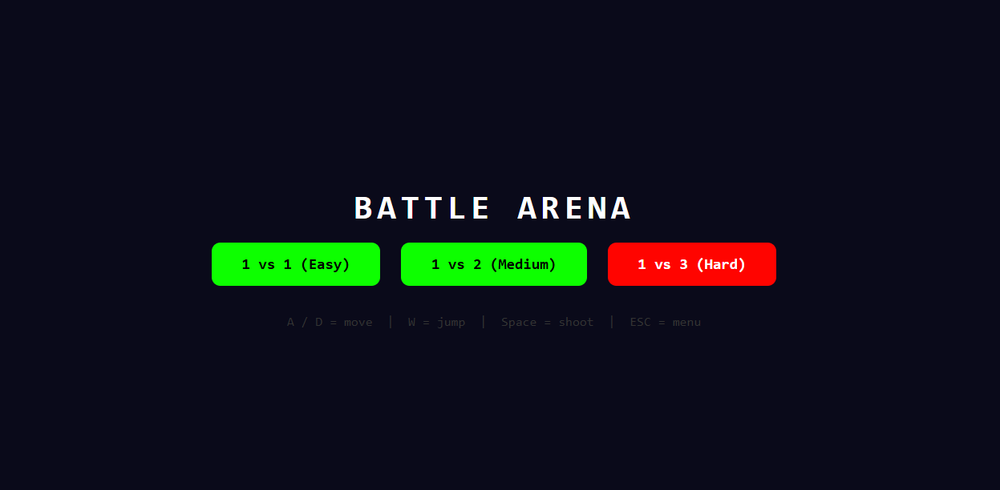

# 🎮 Simple Browser Game

A fun and interactive browser-based game built using HTML, CSS, and JavaScript.
Play directly in your browser — no setup needed!

---

## 🚀 Getting Started

Follow these steps to run the project:

### 1️⃣ Install a Code Editor

Download and install **VS Code** or any code editor.

---

### 2️⃣ Create Project Folder

```sh
mkdir my-game
cd my-game
```

---

### 3️⃣ Create HTML File

```sh
touch index.html
```

---

### 4️⃣ Add Your Code

Open the folder in VS Code and paste your game code inside `index.html`.

---

### 5️⃣ Run the Project

```sh
# Option 1: Open directly
open index.html

# Option 2 (Recommended): Use Live Server in VS Code
# Right-click index.html → Open with Live Server
```

✨ Now open in browser and see the magic!

---

## 🎮 Controls

```sh
A / D  -> Move
W      -> Jump
Space  -> Shoot
Esc    -> Menu
```

---

## 🛠️ Tech Stack

```sh
HTML
CSS
JavaScript
```

---

## 💡 Future Improvements

* Add sound effects
* Add enemies
* Add levels
* Improve UI/UX

---

## ⭐ Support

If you like this project, give it a ⭐ on GitHub!
